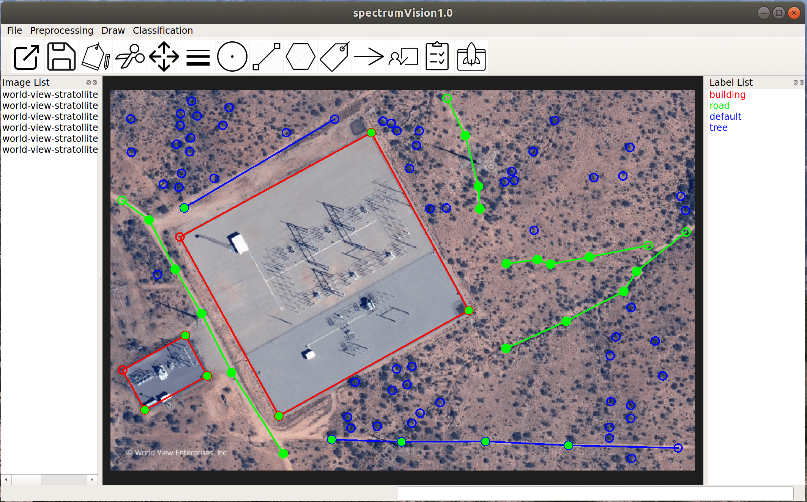

# SIP (smart image processing) 

Intelligent pixel-level image classification using deep neural networks.

# Features

* **Strong feature learning capability** of deep neural networks to capture weak signature information for accurate pixel-level classification and mapping.

* **Fast processing and mapping** of a large number of image scenes by leverating GPU computation;

* **Quickly drawing some examplar pixels** using lines, points and polygons on one scene gives you high-precision pixel-level label map of the whole scene;

* Quickly drawing some lines, points and polygons on mutiple scenes gives you **a robust classifer that generates accurate predictions on new images**; 

* Accurate pixel-level classification and mapping of **many hundreds or thousands large scenes** (e.g., 5k by 5k pixels) can be achived within a single day using **a single desktop with GPU**;

* **Safe and convenient** for research, industry or governmental usage where all the data and data processing is local, avoiding the troubles of uploading your data to the cloud.

* Runs on **multiple system settings**, e.g., loptop with/without GPU, desktop with/without GPU, server with/without GPU; 

* Runs on **multiple operational systems**, e.g., Linux, Windows, MacOS; 

* **Strong preprocessing functionalities** to support open source or commercial images, e.g., **Drone hyperspectral/multispectral image**, Sentinel-1/2/3, RADARSAT-1/2, **RADARSAT Constellation Mission (RCM)**, Landsat, MODIS, Drone images, and other **biomedical and industrial images**;

# Documentation
* [Installation](docs/installation.md)
* [Tutorials](docs/tutorial.md)
* [Data preprocessing](docs/data_preprocessing.md)
* [Config file](docs/config_file.md)
* [FAQ](docs/qa.md)
<!---* [Getting started](docs/get-started.md)--->
<!---* [Introduction](intro.md)--->
<!---* [Parameters](parameters.md)--->
<!---* [How To](how-to.md)--->
<!---* [FAQ](faq.md)--->
<!---* [Related Websites](related-website.md)--->

# First example: Process Sentinel-1 SAR image for sea ice classification

**Step 1: Run app and open data.** 
- Run SIP;
- Open the '.json' file in ***'SIP/data/sentinel1_preprocessed_imgs'***;
- Also open the associated '.tiff' image.

**Step 2: Draw region of interst (ROI).**  
- ***Double click a class*** in the 'Label List' panel on the right to choose a class; 
- Draw point, or line or polygon to add more ROI for this class;
- ***To finish drawing line and polygon, type 'c' from keyboard***;
- Save drawing using default name;

**Step 3: Edit config file.** 
- Copy the ***config_os.yaml.bak*** in the config folder and change its name to ***config_os.yaml***;
- Find ***sentinel1_params***, ***raw_data_dir***, ***dirs***; ***For all directories in these three parameters, make sure you have changed them to your own directories***.

**Step 4: Prepare label mask.** 
- Click on ***"Get masks"*** under ***Classification*** menu;
- First select the config file you just edited, and then select the csv file you just saved;
- This step transfer ROIs from vectors to mask images;
- Take a look at the png images generated in the ***raw_img_dir*** directory in the config file;

**Step 5: Prepare all dirs and data.** 
- Click on ***"Prepare data"*** under ***Classification*** menu to prepare all training, test and prediction data. 
- You need to choose the .yaml 'config' file you just edited. 
- Once finished, go to ***dirs->data->train/val/test/predict*** folders in the config file, to open and take a look at the ***data_file.yaml*** files. Think about why ***dirs->data/predict*** has different image with train, val and test.   

**Step 6: Train classifier.** 
- Click on ***'Train classifier'*** under ***Classification*** menu and then choose the .yaml config file you just edited. 
- Once training is finished, go to ***raw_data_dir*** in the config file to take a look at the generated label maps of the training images. 
- Go to ***dirs->save->model*** folder in the config file, check ***the training and validation accuracies*** in the ***train.log*** file.

**Step 7: Test classifier.** 
- You can optionally run ***"Test classifier"*** under the ***Classification***, but it will run on the same image using the trained model in Step 6. 
- You also need to select the same .yaml config file. 
- Check the ***test accuracies*** in the "test.log" file under the ***dirs->save->model*** folder in the config file.  

**Step 8: Predict label map on a new image.** 
- Click on ***"Predict image"*** under the ***Classification*** menu to run the trained model on the other scene in the ***raw_img_dir*** folder. You also need to select the same config file. 
- Once it is done, you can check the label map of the test image in the ***raw_img_dir*** folder.
- Check the "predict.log" file under the ***dirs->save->model*** folder in the config file. 

