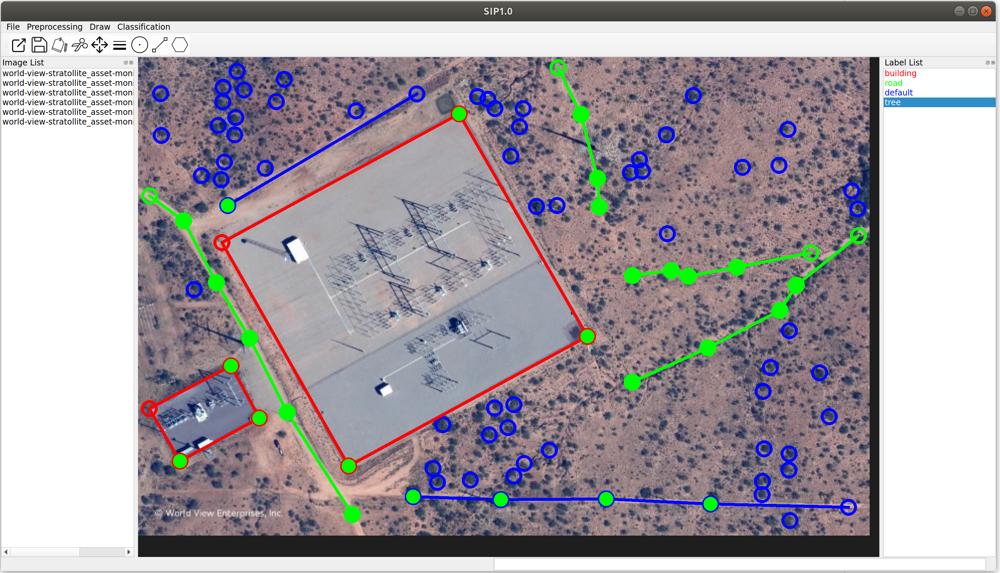
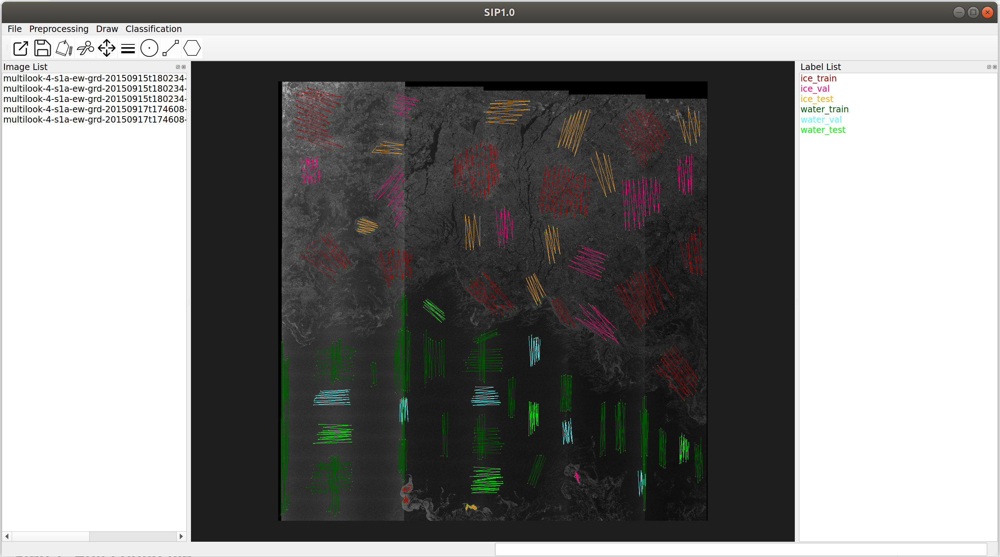
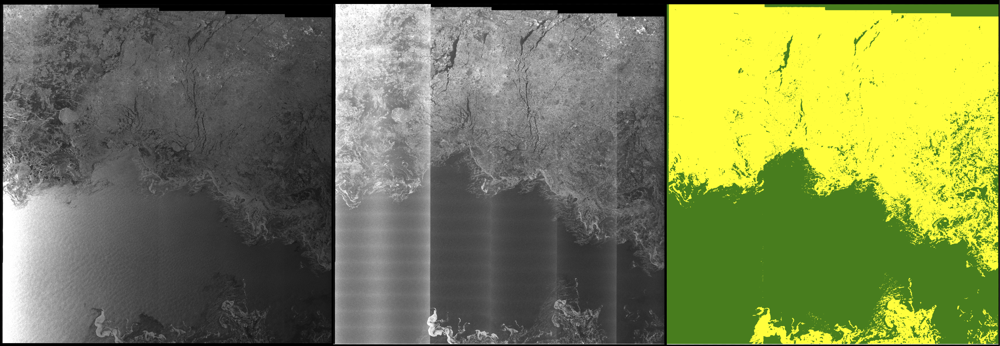
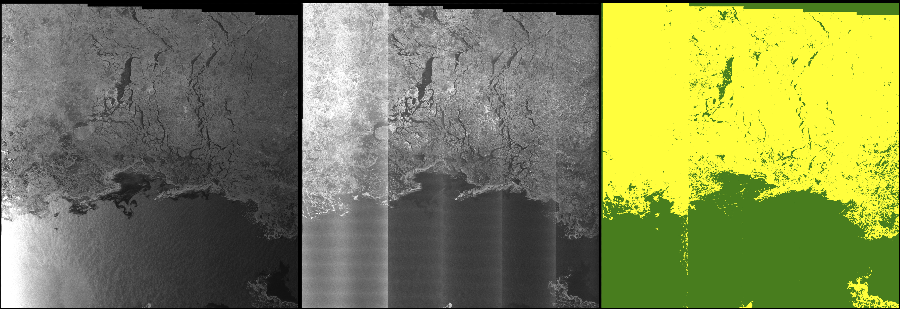

# SIP (smart image processing) 

Intelligent pixel-level image classification using deep neural networks.

# Features

* **Strong feature learning capability** of deep neural networks to capture weak signature information for accurate pixel-level classification and mapping.

* **Fast processing and mapping** of a large number of image scenes by leverating GPU computation;

* **Quickly drawing some examplar pixels** using lines, points and polygons on one scene gives you high-precision pixel-level label map of the whole scene;

* Quickly drawing some lines, points and polygons on mutiple scenes gives you **a robust classifer that generates accurate predictions on new images**; 

* Accurate pixel-level classification and mapping of **many hundreds or thousands large scenes** (e.g., 5k by 5k pixels) can be achived within a single day using **a single desktop with GPU**;

* **Safe and convenient** for research, industry or governmental usage where all the data and data processing is local, avoiding the troubles of uploading your data to the cloud.

* Runs on **multiple system settings**, e.g., loptop with/without GPU, desktop with/without GPU, server with/without GPU; 

* Runs on **multiple operational systems**, e.g., Linux, Windows, MacOS; 

* **Strong preprocessing functionalities** to support open source or commercial images, e.g., **Drone hyperspectral/multispectral image**, Sentinel-1/2/3, RADARSAT-1/2, **RADARSAT Constellation Mission (RCM)**, Landsat, MODIS, Drone images, and other **biomedical and industrial images**;

# Documentation
* [Installation](docs/installation.md)
* [Tutorials](docs/tutorial.md)
* [Data preprocessing](docs/data_preprocessing.md)
* [Config file](docs/config_file.md)
* [FAQ](docs/qa.md)
<!---* [Getting started](docs/get-started.md)--->
<!---* [Introduction](intro.md)--->
<!---* [Parameters](parameters.md)--->
<!---* [How To](how-to.md)--->
<!---* [FAQ](faq.md)--->
<!---* [Related Websites](related-website.md)--->
# First example: Process Sentinel-1 SAR image for sea ice classification

**Step 1: Edit config file.** 
- Go to ***your_SIP_install_dir/config*** folder;
- Find ***config_linux.yaml.bak***; make a copy of it, and rename the copied file to ***config_linux.yaml***. Do the same to ***config_win.yaml.bak*** if you use Windows systems;
- Open the ***config_os.yaml**** file. Find ***raw_img_dir*** under ***raw_data_params***, change its value to be ***/your_SIP_install_dir/data/sentinel1_preprocessed_imgs/***; 
- Similarly, also change all directories under ***dirs*** (e.g., dirs->data-train, dirs-save-model, etc.) to your own directories;

**Step 2: Run app and open data.** 
- Run SIP by typing ***python SIP.py*** in the ***your_SIP_install_dir***;
- Open the 'multilook-4-s1a-ew-grd-20150915t180234-20150915t180338-007729-00abc9_hv-002.tiff' file in ***raw_img_dir*** folder defined in the ***config_os.yaml*** file;
- Click ***yes*** on the ***Label file*** dialogy, and open the default '.json' file;
- You will see the SAR image with lines of different colors for the ***ice*** and ***water*** classes for respectively ***training***, ***validation*** and ***test*** sets; 
- Pixels that fall on these lines will be used as training, validation and test samples;

**Step 3: Draw training, validation and test samples for different classes.**  
- ***Double click a class*** in the ***Label List*** panel on the right to choose a class; 
- Draw ***point, or line or polygon*** to add more samples for this class;
- ***To finish drawing line and polygon, type 'c' from keyboard***;
- ***To Delete an object***, click the ***Edit drawing button***, then put the mouse ***over an object***; when this object ***turns white***, press the ***Delete key*** to delete this object; 
- ***To save drawing***, click the ***save button*** and use ***the default name*** to save the your drawing;

**Step 4: Generate training, validation and test masks.** 
- Click on ***"Get masks"*** under the ***Classification*** menu;
- Select the ***config_os.yaml*** file you edited in ***your_SIP_install_dir/config/*** folder, and then select the ***default csv file*** under the ***your_SIP_install_dir/data/*** folder;
- This step transfer ROIs from vectors to mask images;
- Take a look at the ***png images*** generated in the ***raw_img_dir*** directory defined in ***config_os.yaml***;

**Step 5: Prepare all dirs and data.** 
- Click on ***"Prepare data"*** under the ***Classification*** menu to prepare all training, validation, test and prediction data. 
- You need to choose the ***config_os.yaml*** file. 
- Once finished, go to ***dirs->data->train/val/test/predict*** folders defined in ***config_os.yaml***, to open and take a look at the ***data_file.yaml*** files. Think about why ***dirs->data/predict*** has different image with train, val and test.   
- In ***raw_img_dir*** folder, the images (i.e., multilook-4-s1a-ew-grd-20150917t174608-20150917t174713-007758-00ac93_hv-002.tiff and the hh image) on which you did not draw any training, validation, or test samples will be automatically used for prediction;

**Step 6: Train classifier.** 
- Click on ***Train classifier*** under the ***Classification*** menu and then choose the ***config_os.yaml*** file. 
- Once training is finished, go to ***raw_img_dir*** defined in ***config_os.yaml***  to take a look at the generated label maps of the training images. It then generates a label map for the whole image. 
- Go to ***dirs->save->model*** folder defined in ***config_os.yaml***, check ***the training and validation accuracies*** in the ***modelName-trainTime-train.log*** file.

**Step 7: Test classifier.** 
- You can optionally run ***"Test classifier"*** under ***Classification***. Select the ***config_os.yaml*** file.
- It will calculate ***test accuracies*** using the ***test samples*** defined in the ***.json*** file.
- Check the ***test accuracies*** in the "modelName-testTime-test.log" file under the ***dirs->save->model*** folder defined in ***config_os.yaml***.  

**Step 8: Predict label map on a new image.** 
- Click on ***"Predict image"*** under ***Classification*** to run the trained model on the other scene in the ***raw_img_dir*** folder. You also need to select ***config_os.yaml***. 
- Once it is done, you can check the label map of the test image in the ***raw_img_dir*** folder.
- Check the "modelName-testTime-predict.log" file under the ***dirs->save->model*** folder defined in ***config_os.yaml***. 

