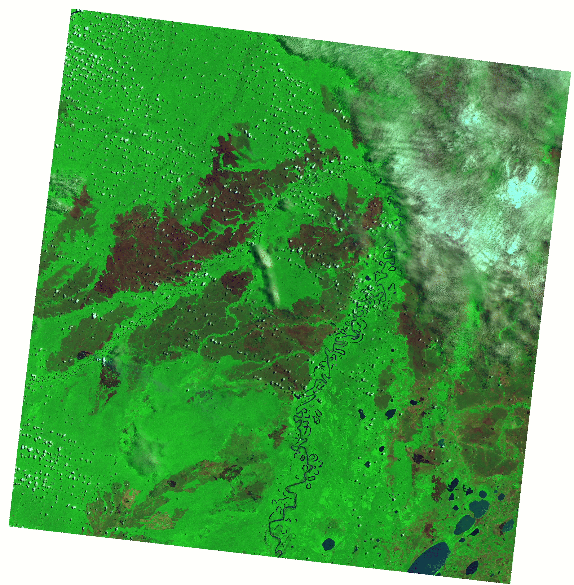

# Wildfire burned and unburned area classification from Landsat-8 images
## Classification using ss_res classifier

**Step 1: Download Landsat-8 wildfire images**
- Go to USGS EarthExplorer (https://earthexplorer.usgs.gov/);
- Under the ***'Data Sets'*** panel, select ***'Landsat'***, ***'Landsat Collection 1 Level-1'***, and ***'Landsat 8 OLI/TIRS C1 Level-1'***
- Under the ***'Additional Criteria'*** panel, fill ***'Landsat Product Identifier'*** with LC08_L1TP_001069_20191013_20191018_01_T1 to find the first scene and download the ***Level-1 GeoTIFF Data Product***. 
- Similarly search LC08_L1TP_220067_20191011_20191018_01_T1, LC08_L1TP_228070_20191003_20191018_01_T1 and LC08_L1TP_229071_20191010_20191018_01_T1 to download the other three scenes. 

**Step 2: Download FIRMS active wildfire/hotspot shapefile data**
- Go to https://firms.modaps.eosdis.nasa.gov/download/;
- Create a new request of shapefile covering South America from 2019.01.01 to 2019.12.31; 
- Download data when it is ready;

**Step 3: Run app and preprocess Landsat-8 raw data** 
- Copy all downloaded .tar.gz files to the SIP/data/landsat8_raw_zip/ folder;
- Copy the ***landsat8_config_os.yaml*** in the config folder and change its name to ***landsat8_config_os.yaml***;
- Edit ***landsat8_config_os.yaml*** to ensure all parameters are setted correctly. See [config file](config_file.md) for instructions. Here, you may want to set ***multilook_number: 1*** to keep the same size, make sure ***to_use_cut_values*** is True to use the default cut values for increasing image contrast with better visualization;
- Run SIP, and click on ***"preprocessing -> Landsat8 L1TP"***;
- First select the /data/landsat8_raw_zip/ folder, and then ***select the landsat8_config_os.yaml file*** you just edited. 
- Once finished, take a look at the preprocessed scenes in /data/landsat8_preprocessed_imgs/ folder;

**Step 4: Open false color composite 753 for visualization**

- In ArcGIS or QGIS, open the open the rgb753 false color image of the LC08_L1TP_001069_20191013_20191018_01_T1_rgb753 scene in the /data/landsat8_preprocessed_imgs folder. Also, open the active fire points data you downloaded in Step 2. The burned areas have a ***dark red*** color in rgb753 image and should have fire points (hotspots) overlayed on it. When you draw ground truth samples, make sure you follow this criterion.

**Step 5: Edit the labels of classes in SIP**
- In SIP, click the ***Open an image*** button to open the rgb753 false color image of the LC08_L1TP_001069_20191013_20191018_01_T1_rgb753 scene in the /data/landsat8_preprocessed_imgs folder; Click on ***no*** when it asks you for label file. 
- In SIP, click the ***Edit class labels*** button, and type 4 and click ok button; 
- Type 'burn_train', 'burn_val', 'unburn_train', 'unburn_val' respectively for label names 2, 3, 4, 5; then, select different colors for these 2, 3, 4, 5 classes. Here, 'burn' and 'unburn' have to be exactly the same with the ***my_classes*** parameter in the [config file](config_file.md). 

**Step 6: Draw ground truth samples for the 4 classes in SIP**  
- ***Double click a class*** in the 'Label List' panel on the right to choose a class; 
- Draw line or polygon to add more ROI for this class; make sure you follow the criterion in Step 4, and always double-check with the ArgGIS image and fire point to make sure. 
- ***To finish drawing line and polygon, type 'c' from keyboard***;
- ***Save drawing using default name***.
- If you want to delete a ROI, click the ***Edit drawing*** button, move the mouse to the ROI, and press the ***delete button*** when the ROI boundary turns white;
- If you want to move a ROI, click the ***Edit drawing*** button, move the mouse to the ROI, and drag it when the ROI boundary turns white; 
- If you want to change the label of a ROI, click the ***Edit drawing*** button, move the mouse to the ROI, and right click it when the ROI boundary turns white. Select the class you want from the pop up window;
 
**Step 7: Draw train and validation samples for another scene** 
- Once you finished drawing ground truth samples for LC08_L1TP_001069_20191013_20191018_01_T1_rgb652, ***do the same for LC08_L1TP_228070_20191003_20191018_01_T1_rgb652***;

**Setp 8: Draw burn_test and unburn_test samples for LC08_L1TP_220067_20191011_20191018_01_T1**
- In ArcGIS or QGIS, open the open the rgb753 false color image of the LC08_L1TP_220067_20191011_20191018_01_T1_rgb753 scene in the /data/landsat8_preprocessed_imgs folder. Also, open the active fire points data you downloaded in Step 2. The burned areas have a ***dark red*** color in rgb753 image and should have fire points (hotspots) overlayed on it. When you draw ground truth samples, make sure you follow this criterion.
- In SIP, click the ***Edit class labels*** button, and type 2 and click ok button; 
- Type 'burn_test', 'unburn_test' respectively for label names; then, select different colors for these two classes. Here, ***you do not need to draw train or val samples for this scene***. Also, the'burn' and 'unburn' have to be exactly the same with the ***my_classes*** parameter in the [config file](config_file.md). 
- draw ***burn_test*** and ***unburn_test*** samples for this scene in a same manner as you did in Step 6;
- ***save drawing using the default file name***

**Setp 9: Draw burn_test and unburn_test samples for LC08_L1TP_229071_20191010_20191018_01_T1**
- Do the same for LC08_L1TP_229071_20191010_20191018_01_T1, as you did in Setp 8. 

**Step 10: Prepare label mask.** 
- Click on ***"prepare label mask"*** under ***classification*** menu;
- First select the config file you just edited, and then select the two csv files you just saved for the two scenes;
- This step transfer ROIs from vectors to mask images;
- Take a look at the png images generated in the "Image List" panel on the left;

**Step 11: Prepare all dirs and data** 
- Click on ***"prepare all dirs and data"*** under ***classification*** menu to prepare all training, test and prediction data. 
- You need to choose the .yaml 'config' file you just edited. 
- Once finished, take a look at all the folders generated and 'npz' files under ***data*** folders and 'png' mask files under ***mask*** folders in ***train***, ***val*** and ***test***.  
- under the ***data/train*** folder, you should see the npz files for LC08_L1TP_001069_20191013_20191018_01_T1 and LC08_L1TP_001069_20191013_20191018_01_T1, and under the ***data/test*** folder you should see the npz files for the other two scenes. Same for the ***mask/train*** and ***mask/test*** folders. 

**Step 12: Train classifier on LC08_L1TP_001069_20191013_20191018_01_T1 and LC08_L1TP_001069_20191013_20191018_01_T1** 
- Make sure your set ***net_type: ss_res*** in the config file. 
- Click on ***'train classifier'*** under ***classification*** menu and then choose the .yaml config file you just edited. 
- Once training is finished, you can see the generated label map by clicking on this file in the 'Image List' panel on the left. 
- Check ***the training and validation accuracies*** in the "train_log" file under the "save_model" folder specified in the .yaml config file you edited. 
- Change the ***number of epoches*** in the .yaml config file and see what happens. 

**Step 13: Test the classifier on the other two scenes** 
- Click on ***"Test classifier"*** to test the trained model on the other scene in the folder.
- Once it is done, you can also check the label map in the "Image List" panel, and also in the ***/all_data/save/test/*** folder. You also need to select the same .yaml config file.
- Check the "test_log" file under the "save_model" folder specified in the .yaml config file to see the ***test accuracies*** on these two scenes.  

## Compare different classifiers

**Step 1: select random forest 'rf' in the config file**
- Open the ***"landsat8_config_os.yaml"*** config file in the 'config' folder
- Make sure you set ***net_type: svm***
- Make sure you set ***patch_size: 1*** to use only single pixels
- Random forest training is slow, you can use a small proportion of the training samples by set ***prop_train*** to a small number, e.g., 0.0001, depending on how many pixels in you ROIs. 
 

**Step 2: prepare data, train rf and predict**
- Go to step 9 in the above to start from there; 
- Once all steps are finised, please compare the four classification maps (two train, two predict) achieved by ***rf*** with the four maps achieved by ***ss_res***;

**Step 3: do the same for spectral_res, svm and knn classifiers**
- go over step 1 and step 2, but replace rf with svm and knn;
- compare the classification maps, train accuracy and val accuracy of all four methods (i.e., ss_res, knn, rf, svm);
- the comparison between spectral_res and spatial-spectral res, i.e., ss_res, may highlight the role of spatial coherence; 

## Compare classifier performance using different number of training samples

**Step 1: train rf on a small number of training samples**
- Open the ***"landsat8_config_os.yaml"*** config file in the 'config' folder
- Make sure you set ***net_type: rf***
- Make sure you set ***patch_size: 1*** to use only single pixels
- Set ***prop_train: 0.0001*** to use 0.01% of all the training samples. Write down the total number of training samples. 

**Step 2: train rf on different number of training samples**
- Open the same config file ***"landsat8_config_os.yaml"*** 
- Do three more experiments using respectively ***prop_train: 0.0005***, ***prop_train: 0.001***, and ***prop_train: 0.01*** to get the four classification maps and val accuracies;

**Step 3: do the same for svm, knn, and res_ss**
- go over step 1 and step 2, but replace rf with the other classifiers;
- once finished, each classifier 4 test and validation accuracies and 4 maps; compare these results;

