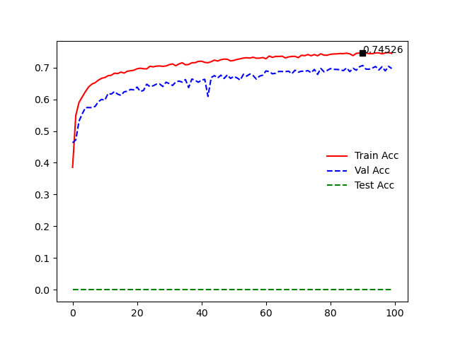
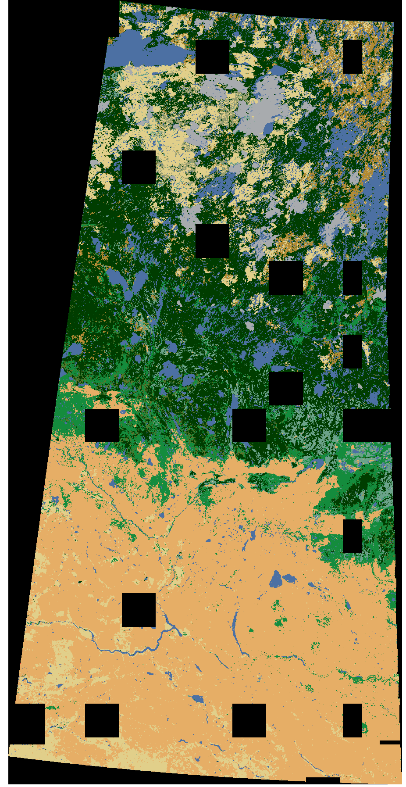

# Feature Importance Evaluation and Classifier Comparison

## Tutorial Objectives

* Train dip-res model on Saskatchewan province and test on Alberta prvince using EVI time series.

* Compare performances of the same classifier using different time series input.

* Compare performances of different classifiers using the same input. 

## Key challenges

* Strong ***signature variabilities*** of different land cover classes in EVI time series.

## Classifiers

* Rondom forest (***rf***), which has been widely used in MODIS time series classification

* Supported vector machine (***svm***)

* Patch-based spatial-spectral residual (***ss-res***) convolutional neural network 

* Patch-based spectral residual (***spe-res***) convolutional neural network

* Image-based fully convolutional residual (***fcn-res***, called dip-res in SIP) network  

## Experiment 1: Train fcn-res/dip-res on Saskatchewan and test on Alberta using EVI time series

* **Generate EVI time series training blocks for Saskatchewan**

    1. Download and process data according to [the preprocessing tutorial](./modis_250m_preprocessing.md).
    1. Assume that the final train blocks are saved into ***MOD13Q1_preprocessed_imgs_sask_evi***
 
* **Generate EVI time series training blocks for Alberta**

    1. Download and process data according to [the preprocessing tutorial](./modis_250m_preprocessing.md).
    1. Assume that the final train blocks are saved into ***MOD13Q1_preprocessed_imgs_alta_evi***

* **Prepare data for Saskatchewan**
    1. Open ***config_os.yaml*** and ensure that ***raw_img_dir*** points to the folder with preprocessed time series blocks, i.e., ***MOD13Q1_preprocessed_imgs_sask_evi***, ***raw_band_names*** consists of '\*all-channels.tiff', ***dirs -> data/mask/save*** are set using your own directories, ***num_classes*** equals 15, ***is_colors_defined_in_rgb_values*** is True, and ***my_colors*** consists of 17 colors of rgb values, and ***my_classes*** consists of 17 class names. Out of the 19 classes, Class3, Class4, Class7 and Class9 should not be used.  
    1. Open ***config_os.yaml***, under ***random_split_samples_params***, set ***to_random_split_samples*** and ***to_split_on_image_level*** to be ***True***. Set ***train_proportion*** to be ***0.8***, ***val_proportion*** to be ***0.2***, and ***test_proportion*** to be ***0***.
    1. Run SIP, and click on ***Classification -> Prepare data***. Once finished, go to ***dirs -> data -> train*** defined in the config file and open ***data-file.yaml*** to take a look at the training block list. 
 
* **Train dip-res model on Saskatchewan**

    1. In ***config_os.yaml***, under ***train_params***, ***lr*** equals 0.0001, ***batch_size_train/val/test/predict*** equals 2, ***net_type*** is ***dip-res***. 
    1. Save ***config_os.yaml***.
    1. Run SIP, click on ***Train classifier*** under ***Classification***, choose the ***config_os.yaml*** you edited. 
    1. If you want to use the save model file to continue training, set ***to_resume_from_latest_checkpoint*** to be ***True*** and also set ***resume_checkpoint_file*** to the model file under ***dirs -> save -> model*** defined in ***config_os.yaml***.  
    1. Record the training and validation accuracies.

 

* **Mosaic training classification maps for Saskatchewan**
    1. In ***Config_os.yaml***, under ***Modis_params***, set ***Modis_maps_merge_params*** to be ***True***, set ***input_dir_maps_merge_Modis*** to be ***dirs -> save -> train*** folder defined in ***config_os.yaml*** where you have the classification maps of training images, and set ***maps_merge_Modis_id_str*** to be '\*predict-map\*geocoded.tiff'. 
    1. In ***Config_os.yaml***, under ***Modis_params***, disable all the other preprocessing steps by setting ***to_XXXX_Modis*** to be ***False***.
    1. Run SIP, click on ***Preprocessing -> Modis*** to mosaic the classification maps. Once finished, go to ***output_dir_maps_merge_Modis*** defined in ***config_os.yaml*** to take a look at the mosaiced map. Open it in QGIS and compare it with the true map of Saskatchewan. 

* **Mosaic validation classification maps for Saskatchewan**
    1. Copy ***data_file.yaml*** under the ***dirs -> data -> val*** folder defined in ***config_os.yaml*** to ***dirs -> data ->predict***. 
    1. In SIP, run ***Classification -> Predict Image*** to generate classification maps of validation images, and save them into ***dirs -> save -> val*** folder defined in config_os.yaml. 
    1. In ***config_os.yaml***, under ***Modis_params***, set ***Modis_maps_merge_params*** to be ***True***, set ***input_dir_maps_merge_Modis*** to be ***dirs -> save -> predict*** folder defined in ***config_os.yaml*** where you have the classification maps of validation images, and set ***maps_merge_Modis_id_str*** to be '\*predict-map\*geocoded.tiff'. 
    1. In ***config_os.yaml***, under ***Modis_params***, disable all the other preprocessing steps by setting ***to_XXXX_Modis*** to be ***False***.
    1. Run SIP, click on ***Preprocessing -> Modis*** to mosaic the classification maps. Once finished, go to ***output_dir_maps_merge_Modis*** defined in ***config_os.yaml*** to take a look at the mosaiced map. Open it in QGIS and compare it with the true map of Saskatchewan. 

* **Prepare data for Alberta**
    1. Open ***config_os.yaml*** and ensure that ***raw_img_dir*** points to the folder with preprocessed time series blocks, i.e., ***MOD13Q1_preprocessed_imgs_alta_evi***, ***raw_band_names*** consists of '\*all-channels.tiff'. 
    1. Open ***config_os.yaml***, under ***random_split_samples_params***, set ***to_random_split_samples*** and ***to_split_on_image_level*** to be ***True***. Set ***train_proportion*** to be ***0***, ***val_proportion*** to be ***0***, and ***test_proportion*** to be ***1***.
    1. Run SIP, and click on ***Classification -> Prepare data***. Once finished, go to ***dirs -> data -> train*** defined in the config file and open ***data_file.yaml*** to take a look at the training block list. 
 
* **Test dip-res model on Alberta**
    1. Copy the ***data_file.yaml*** file under ***MOD13Q1_preprocessed_imgs_alta_evi -> all_data -> data -> test*** to ***MOD13Q1_preprocessed_imgs_sask_evi -> all_data -> data -> test***. 
    1. Open ***config_os.yaml*** and ensure that ***raw_img_dir*** points to the folder with preprocessed time series blocks, i.e., ***MOD13Q1_preprocessed_imgs_sask_evi***, ***raw_band_names*** consists of '\*all-channels.tiff'.
    1. Run SIP, click on ***Classification -> Test classifier*** to perform test on Alberta. 
    1. Once finish, go to ***all_data -> save -> model*** to take a look at the accuracy in the log file, and also the ***classification maps*** generated.
    1. Compare the training, val and test accuracies for dip-res. 

* **Mosaic test classification maps for Alberta**
    1. In ***config_os.yaml***, under ***Modis_params***, set ***Modis_maps_merge_params*** to be ***True***, set ***input_dir_maps_merge_Modis*** to be ***MOD13Q1_preprocessed_imgs_sask_evi -> all_data -> save -> test*** folder defined in ***config_os.yaml*** where you have the classification maps of test images, and set ***maps_merge_Modis_id_str*** to be '\*predict-map\*geocoded.tiff'. 
    1. In ***config_os.yaml***, under ***Modis_params***, disable all the other preprocessing steps by setting ***to_XXXX_Modis*** to be ***False***.
    1. Run SIP, click on ***Preprocessing -> Modis*** to mosaic the classification maps. Once finished, go to ***output_dir_maps_merge_Modis*** defined in ***config_os.yaml*** to take a look at the mosaiced map. Open it in QGIS and compare it with the true map of Alberta. 

   
## Experiment 2: Train dip-res on Saskatchewan and test on Alberta using NDVI time series

* **Generate NDVI time series training blocks for Saskatchewan and Alberta**

    1. Follow the same procedure in Experiment 1. The only difference is to use NDVI band rather than the EVI band. 

* **Train dip-res model on Saskatchewan and test on Alberta**
    1. Follow the same procedure in Experiment 1. 

* **Compare the train, val and test accuracies with Experiment 1**
    1. Compare accuracies with Experiment 1.
    1. Compare classification maps with Experiment 1.  

## Experiment 3: Train dip-res on Saskatchewan and test on Alberta using time series of 4 reflectance channels

* **Generate 4 reflectance channels time series training blocks for Saskatchewan and Alberta**

    1. Follow the same procedure in Experiment 1. The only difference is to use 4 reflectance bands rather than just the EVI band. 

* **Train dip-res model on Saskatchewan and test on Alberta**
    1. Follow the same procedure in Experiment 1.
 
* **Compare the train, val and test accuracies with Experiment 1**
    1. Compare accuracies with Experiment 1.
    1. Compare classification maps with Experiment 1.  

## Experiment 4: Test on Alberta using high confidence samples

* **Generate high confidence training samples for 4 reflectance channels time series training blocks of Alberta**

    1. Follow Experiment 7 in [the preprocessing tutorial](./modis_250m_preprocessing.md) to generate high confidence training samples for Alberta. You can still use 4 reflectance bands. 

* **Use the same trained dip-res model on Saskatchewan in Experiment 3, but test on new Alberta dataset**
    1. Follow the same procedure in Experiment 1, but use the new Alterta dataset with high confidence training samples.
 
* **Compare the train, val and test accuracies with Experiment 3**
    1. Compare accuracies with Experiment 3. The accuracies should be much higher than Experiment 3, because here we only use high confidence samples to calculate accuracies. 
    1. Compare classification maps with Experiment 3. The classificaiton maps should be the same, because here we use the same model as Experiment 3 to generate maps.  

## Experiment 5: Train spectral Dip resnet on Saskatchewan and test on Alberta
* **Change classifier**
 
    1. The procedure is exactly the same as Experiment 3. The only difference is before you train the model, make sure in ***config_os.yaml*** file, you set ***net_type*** to be ***dip_spe***. 

## Experiment 6: Train patch-based ss_res on Saskatchewan and test on Alberta

* **Generate high confidence reflectance 4 bands time series training blocks for Saskatchewan**

    1. Generate high confidence 4 reflectance samples according to Experiment 6 in [the preprocessing tutorial](./modis_250m_preprocessing.md).
    1. Assume that the final train blocks are saved into ***MOD13Q1_preprocessed_imgs_sask_refl4_sampling***
 
* **Generate high confidence reflectance 4 bands time series training blocks for Alberta**

    1. Generate data according to Experiment 7 in [the preprocessing tutorial](./modis_250m_preprocessing.md).
    1. Assume that the final train blocks are saved into ***MOD13Q1_preprocessed_imgs_alta_refl4_sampling***

* **Prepare data for Saskatchewan**
    1. Open ***config_os.yaml*** and ensure that ***raw_img_dir*** points to the folder with preprocessed time series blocks, i.e., ***MOD13Q1_preprocessed_imgs_sask_refl4_sampling***, ***raw_band_names*** consists of '\*all-channels.tiff', ***dirs -> data/mask/save*** are set using your own directories, ***num_classes*** equals 15, ***is_colors_defined_in_rgb_values*** is True, and ***my_colors*** consists of 17 colors of rgb values, and ***my_classes*** consists of 17 class names. Out of the 19 classes, Class3, Class4, Class7 and Class9 should not be used.  
    1. Open ***config_os.yaml***, under ***random_split_samples_params***, set ***to_random_split_samples*** and ***to_split_on_image_level*** to be ***True***. Set ***train_proportion*** to be ***0.8***, ***val_proportion*** to be ***0.2***, and ***test_proportion*** to be ***0***.
    1. Run SIP, and click on ***Classification -> Prepare data***. Once finished, go to ***dirs -> data -> train*** defined in the config file and open ***data-file.yaml*** to take a look at the training block list. 
 
* **Train ss-res model on Saskatchewan**

    1. In ***config_os.yaml***, under ***train_params***, ***lr*** equals 0.001, ***batch_size_train/val/test/predict*** equals 1000, ***net_type*** is ss-res.
    1. In ***config_os.yaml***, under ***train_params***, ***prop_train*** equals ***0.1_0.1_0.1_0.1_0.1_0.1_0.1_0.1_0.1_0.1_0.1_0.1_0.1_0.1_0.1*** to use 10% samples of each class for training.  
    1. Save ***config_os.yaml***.
    1. Run SIP, click on ***Train classifier*** under ***Classification***, choose the ***config_os.yaml*** you edited. 
    1. If you want to use the save model file to continue training, set ***to_resume_from_latest_checkpoint*** to be ***True*** and also set ***resume_checkpoint_file*** to the model file under ***dirs -> save -> model*** defined in ***config_os.yaml***.  
    1. Record the training and validation accuracies. 

* **Mosaic training classification maps for Saskatchewan**
    1. In ***Config_os.yaml***, under ***Modis_params***, set ***Modis_maps_merge_params*** to be ***True***, set ***input_dir_maps_merge_Modis*** to be ***dirs -> save -> train*** folder defined in ***config_os.yaml*** where you have the classification maps of training images, and set ***maps_merge_Modis_id_str*** to be '\*predict-map\*geocoded.tiff'. 
    1. In ***Config_os.yaml***, under ***Modis_params***, disable all the other preprocessing steps by setting ***to_XXXX_Modis*** to be ***False***.
    1. Run SIP, click on ***Preprocessing -> Modis*** to mosaic the classification maps. Once finished, go to ***output_dir_maps_merge_Modis*** defined in ***config_os.yaml*** to take a look at the mosaiced map. Open it in QGIS and compare it with the true map of Saskatchewan. 

* **Prepare data for Alberta**
    1. Open ***config_os.yaml*** and ensure that ***raw_img_dir*** points to the folder with preprocessed time series blocks, i.e., ***MOD13Q1_preprocessed_imgs_alta_refl4_sampling***, ***raw_band_names*** consists of '\*all-channels.tiff'. 
    1. Open ***config_os.yaml***, under ***random_split_samples_params***, set ***to_random_split_samples*** and ***to_split_on_image_level*** to be ***True***. Set ***train_proportion*** to be ***0***, ***val_proportion*** to be ***0***, and ***test_proportion*** to be ***1***.
    1. Run SIP, and click on ***Classification -> Prepare data***. Once finished, go to ***dirs -> data -> train*** defined in the config file and open ***data_file.yaml*** to take a look at the training block list. 
 
* **Test ss-res model on Alberta**
    1. Copy the ***data_file.yaml*** file under ***MOD13Q1_preprocessed_imgs_alta_refl4_sampling -> all_data -> data -> test*** to ***MOD13Q1_preprocessed_imgs_sask_refl4_sampling -> all_data -> data -> test***. 
    1. Open ***config_os.yaml*** and ensure that ***raw_img_dir*** points to the folder with preprocessed time series blocks, i.e., ***MOD13Q1_preprocessed_imgs_sask_refl4_sampling***, ***raw_band_names*** consists of '\*all-channels.tiff'.
    1. Run SIP, click on ***Classification -> Test classifier*** to perform test on Alberta. 
    1. Once finish, go to ***all_data -> save -> model*** to take a look at the accuracy in the log file, and also the ***classification maps*** generated.
    1. Compare the training, val and test accuracies for ss-res. 

* **Mosaic test classification maps for Alberta**
    1. In ***config_os.yaml***, under ***Modis_params***, set ***Modis_maps_merge_params*** to be ***True***, set ***input_dir_maps_merge_Modis*** to be ***MOD13Q1_preprocessed_imgs_sask_refl4_sampling -> all_data -> save -> test*** folder defined in ***config_os.yaml*** where you have the classification maps of test images, and set ***maps_merge_Modis_id_str*** to be '\*predict-map\*geocoded.tiff'. 
    1. In ***config_os.yaml***, under ***Modis_params***, disable all the other preprocessing steps by setting ***to_XXXX_Modis*** to be ***False***.
    1. Run SIP, click on ***Preprocessing -> Modis*** to mosaic the classification maps. Once finished, go to ***output_dir_maps_merge_Modis*** defined in ***config_os.yaml*** to take a look at the mosaiced map. Open it in QGIS and compare it with the true map of Alberta. 

## Experiment 7: Train svm, rf on Saskatchewan and test on Alberta
* **Change classifier, change trian proportion if too slow**
 
    1. The procedure is exactly the same as Experiment 6. The only difference is, in ***config_os.yaml***, under ***train_params***, change ***0.1*** in ***prop_train*** to smaller proportions, if it is too slow to train svm or rf. 

    1. Compare the performance of different models, i.e., dip-res, ss-res, spectral res, svm, rf. 

  
 
